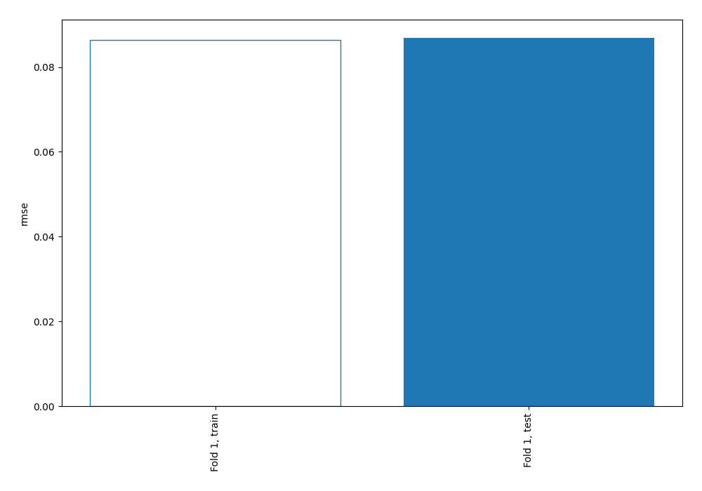
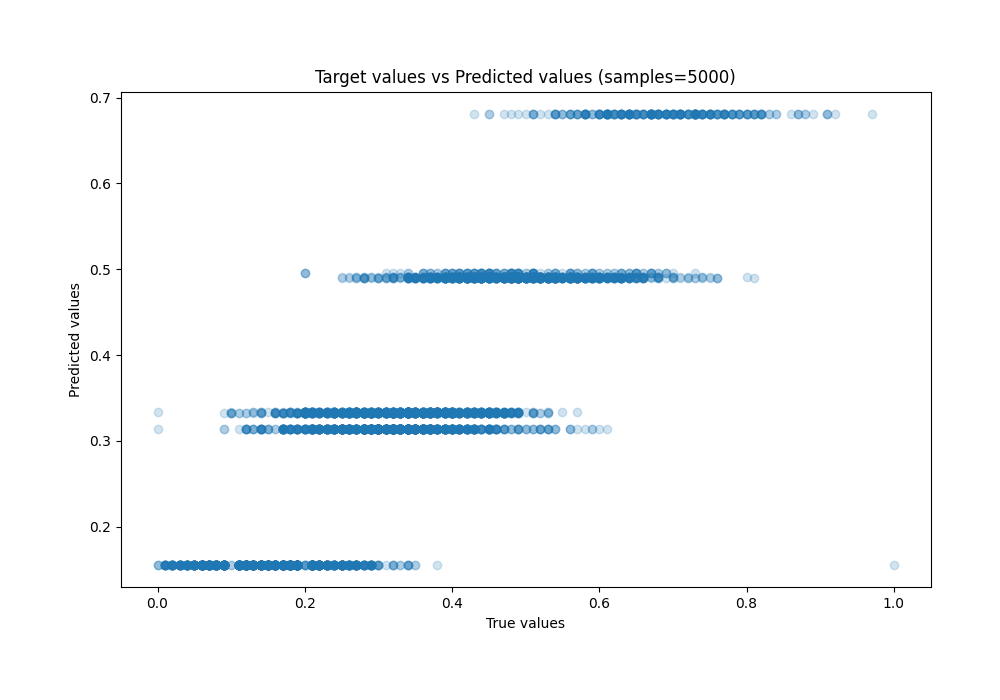
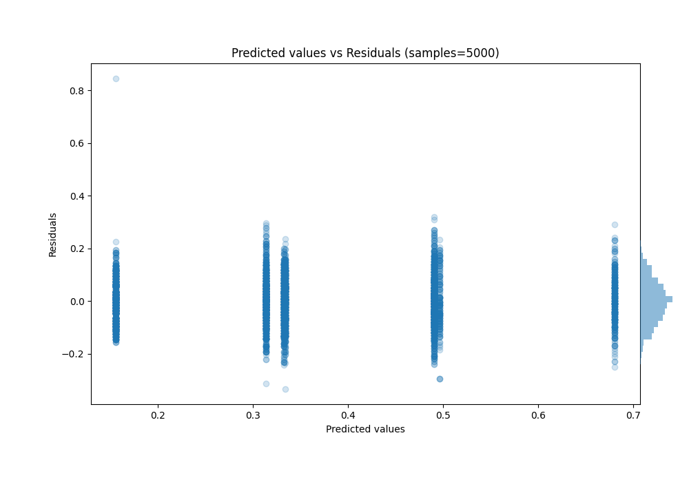

# Summary of 1_DecisionTree

[<< Go back](../README.md)

## Decision Tree
- **n_jobs**: -1
- **criterion**: squared_error
- **max_depth**: 3
- **explain_level**: 0

## Validation
 - **validation_type**: split
 - **train_ratio**: 0.8
 - **shuffle**: True

## Optimized metric
rmse

## Training time

2.5 seconds

### Metric details:
| Metric   |       Score |
|:---------|------------:|
| MAE      | 0.0693517   |
| MSE      | 0.007546    |
| RMSE     | 0.0868677   |
| R2       | 0.727983    |
| MAPE     | 1.34154e+12 |

## Learning curves

## True vs Predicted

## Predicted vs Residuals

[<< Go back](../README.md)
