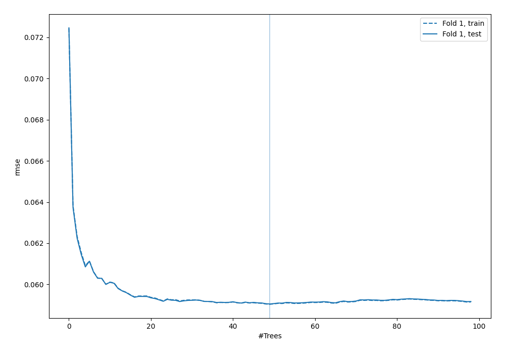
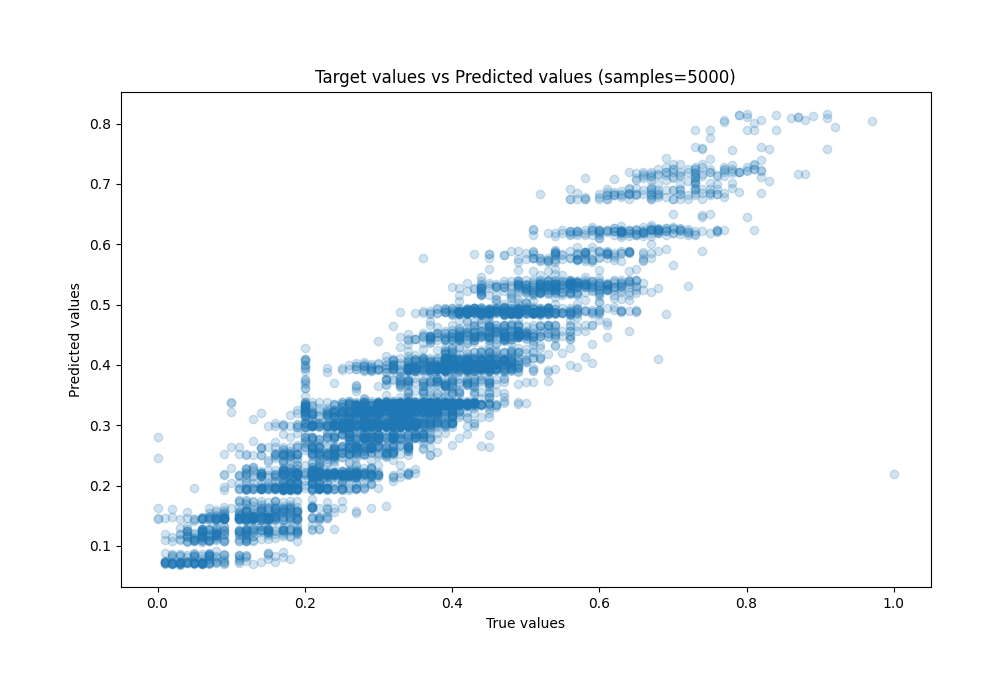
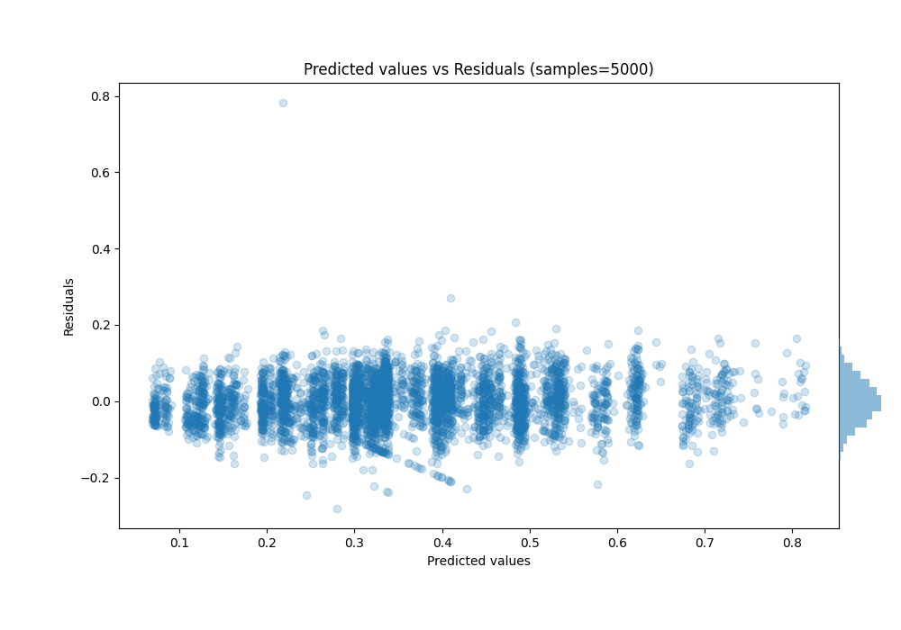

# Summary of 40_RandomForest

[<< Go back](../README.md)

## Random Forest
- **n_jobs**: -1
- **criterion**: squared_error
- **max_features**: 0.6
- **min_samples_split**: 50
- **max_depth**: 6
- **eval_metric_name**: rmse
- **explain_level**: 0

## Validation
 - **validation_type**: split
 - **train_ratio**: 0.8
 - **shuffle**: True

## Optimized metric
rmse

## Training time

23.8 seconds

### Metric details:
| Metric   |       Score |
|:---------|------------:|
| MAE      | 0.0463997   |
| MSE      | 0.00348693  |
| RMSE     | 0.0590503   |
| R2       | 0.874304    |
| MAPE     | 1.13114e+12 |

## Learning curves

## True vs Predicted

## Predicted vs Residuals

[<< Go back](../README.md)
