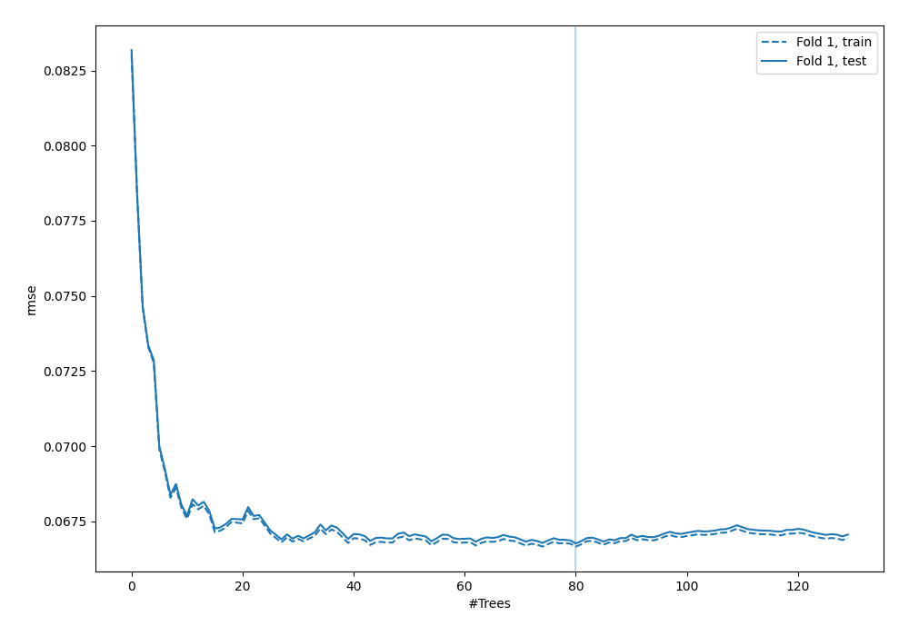
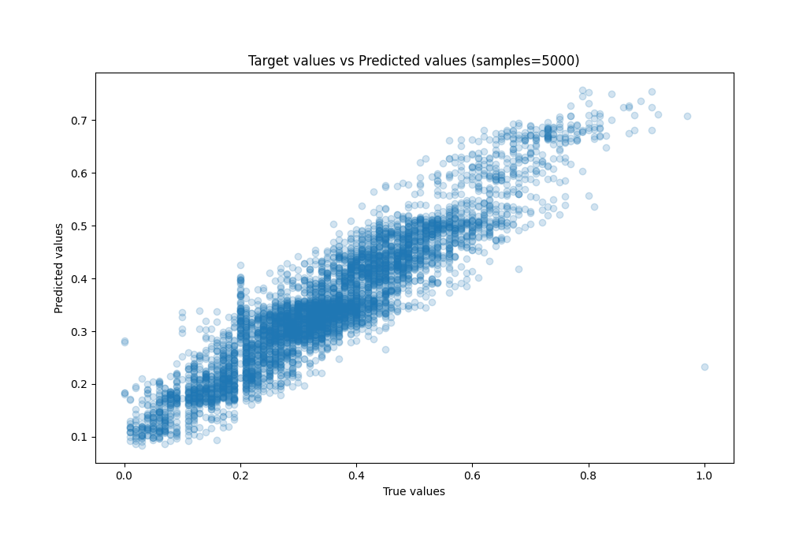
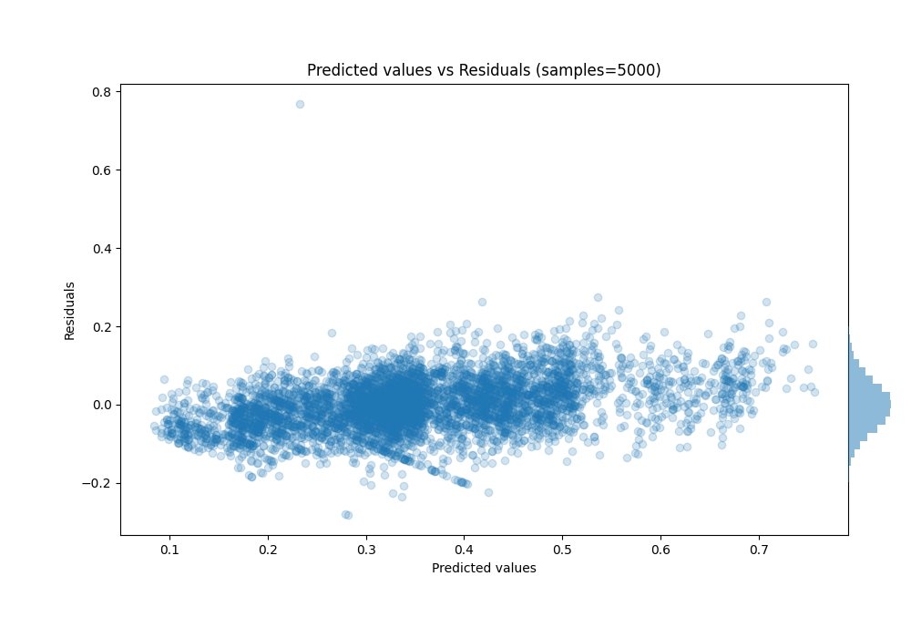

# Summary of 49_ExtraTrees

[<< Go back](../README.md)

## Extra Trees Regressor (Extra Trees)
- **n_jobs**: -1
- **criterion**: squared_error
- **max_features**: 0.6
- **min_samples_split**: 50
- **max_depth**: 6
- **eval_metric_name**: rmse
- **explain_level**: 0

## Validation
 - **validation_type**: split
 - **train_ratio**: 0.8
 - **shuffle**: True

## Optimized metric
rmse

## Training time

29.8 seconds

### Metric details:
| Metric   |      Score |
|:---------|-----------:|
| MAE      | 0.0523701  |
| MSE      | 0.00445701 |
| RMSE     | 0.0667609  |
| R2       | 0.839334   |
| MAPE     | 1.1947e+12 |

## Learning curves

## True vs Predicted

## Predicted vs Residuals

[<< Go back](../README.md)
