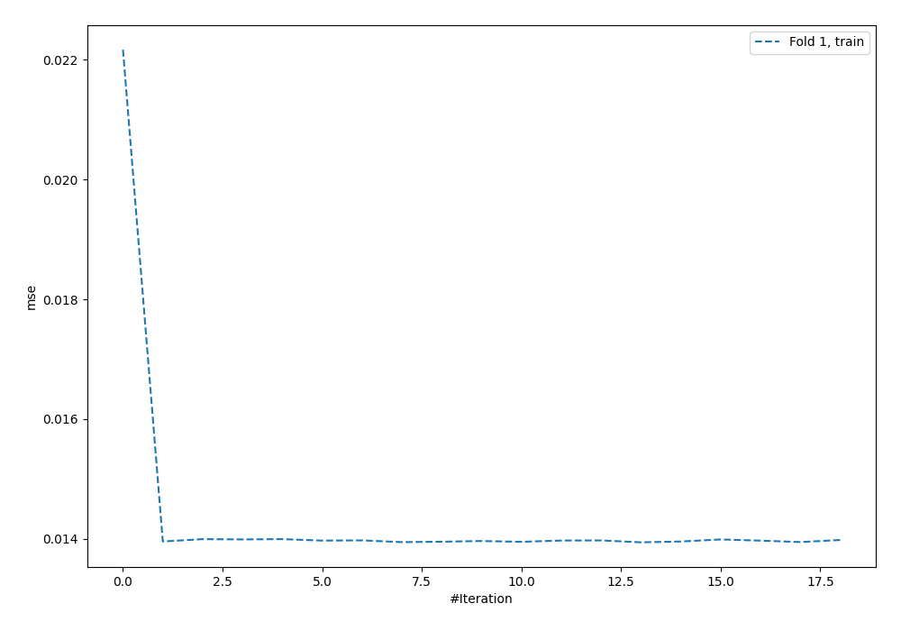
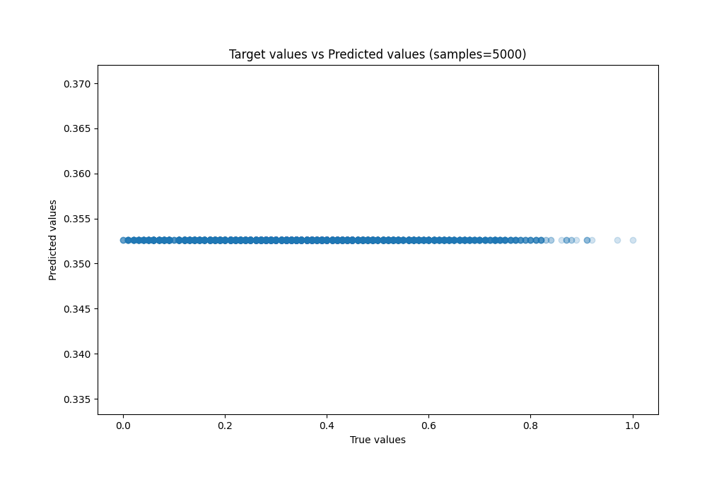
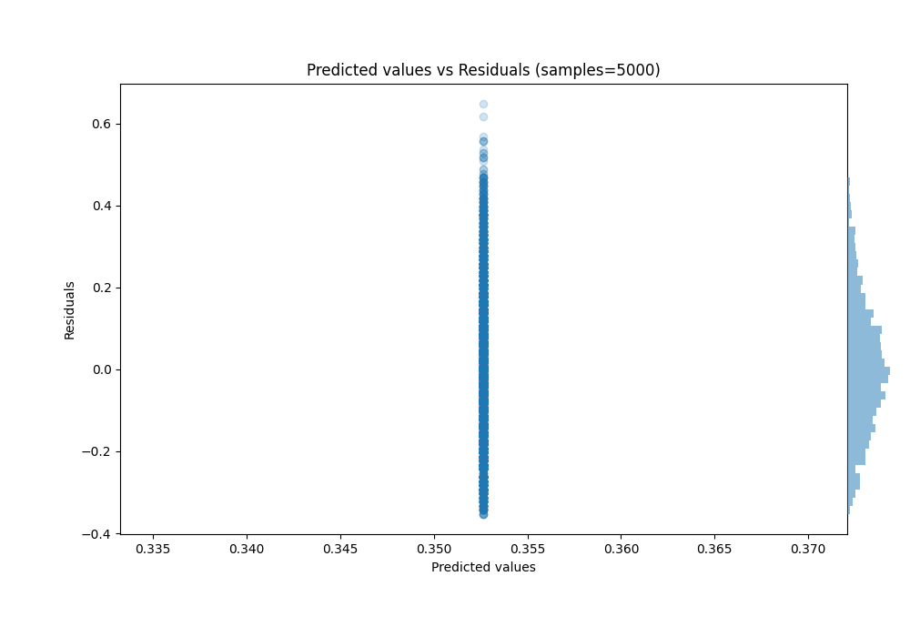

# Summary of 57_NeuralNetwork

[<< Go back](../README.md)

## Neural Network
- **n_jobs**: -1
- **dense_1_size**: 64
- **dense_2_size**: 32
- **learning_rate**: 0.08
- **explain_level**: 0

## Validation
 - **validation_type**: split
 - **train_ratio**: 0.8
 - **shuffle**: True

## Optimized metric
rmse

## Training time

14.6 seconds

### Metric details:
| Metric   |        Score |
|:---------|-------------:|
| MAE      |  0.133011    |
| MSE      |  0.0277417   |
| RMSE     |  0.166558    |
| R2       | -2.60074e-05 |
| MAPE     |  1.71783e+12 |

## Learning curves

## True vs Predicted

## Predicted vs Residuals

[<< Go back](../README.md)
