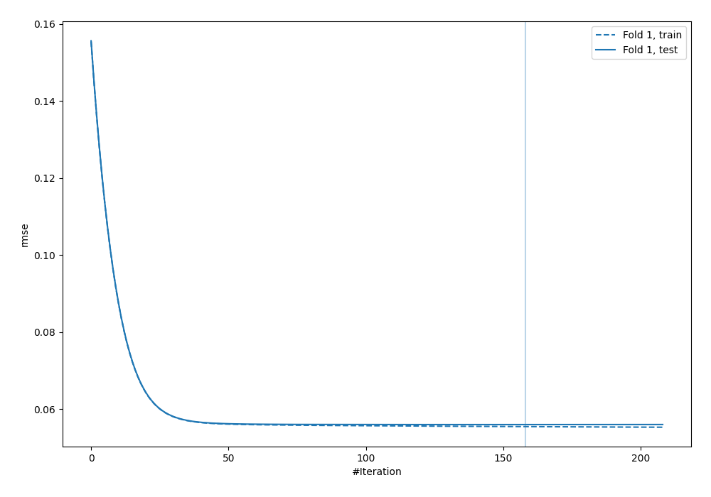
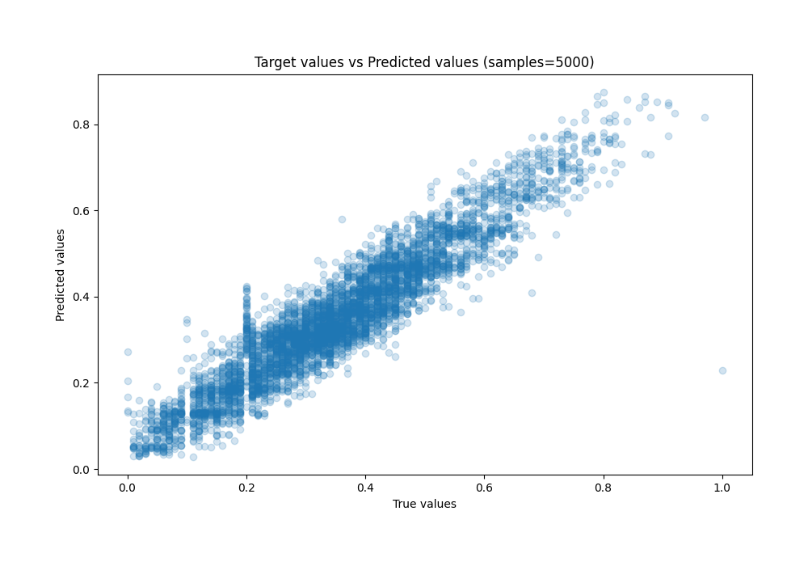
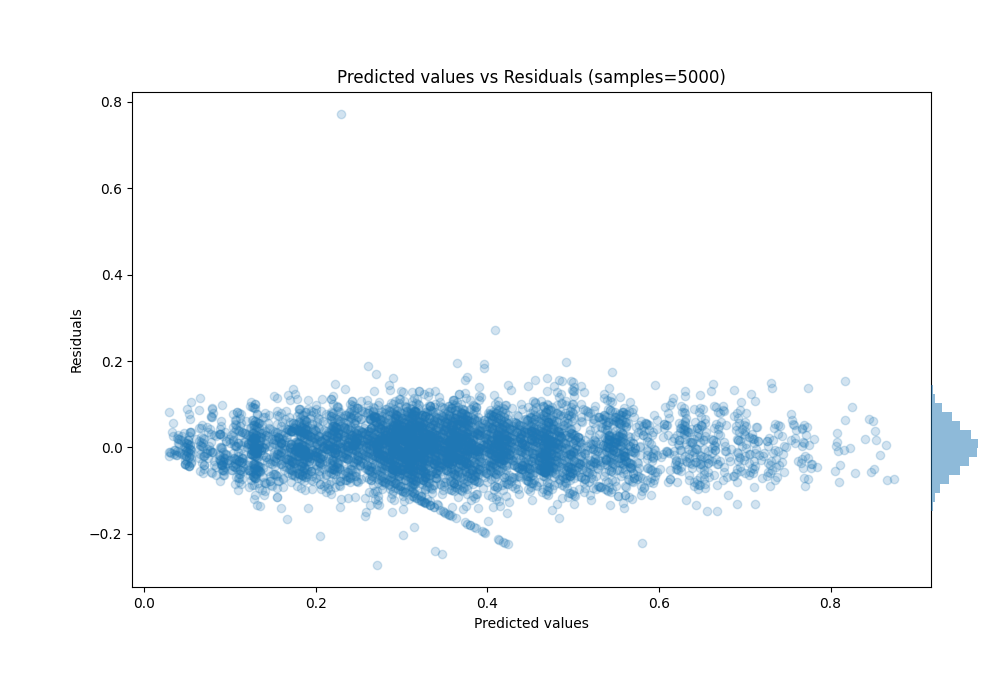

# Summary of 59_Xgboost

[<< Go back](../README.md)

## Extreme Gradient Boosting (Xgboost)
- **n_jobs**: -1
- **objective**: reg:squarederror
- **eta**: 0.075
- **max_depth**: 7
- **min_child_weight**: 5
- **subsample**: 1.0
- **colsample_bytree**: 1.0
- **eval_metric**: rmse
- **explain_level**: 0

## Validation
 - **validation_type**: split
 - **train_ratio**: 0.8
 - **shuffle**: True

## Optimized metric
rmse

## Training time

3.9 seconds

### Metric details:
| Metric   |       Score |
|:---------|------------:|
| MAE      | 0.0434342   |
| MSE      | 0.00313037  |
| RMSE     | 0.0559497   |
| R2       | 0.887157    |
| MAPE     | 1.07243e+12 |

## Learning curves

## True vs Predicted

## Predicted vs Residuals

[<< Go back](../README.md)
