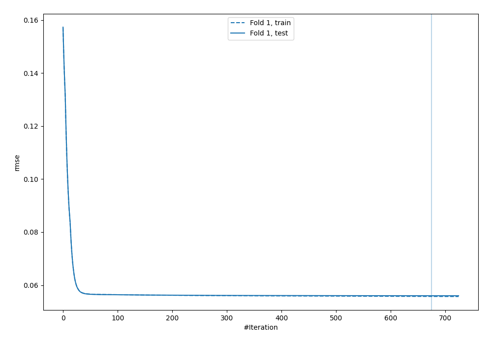
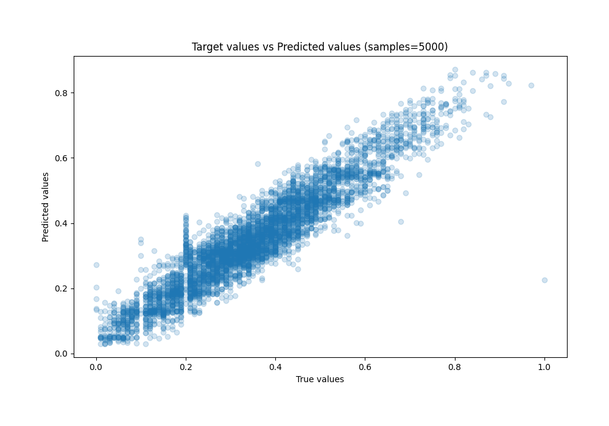
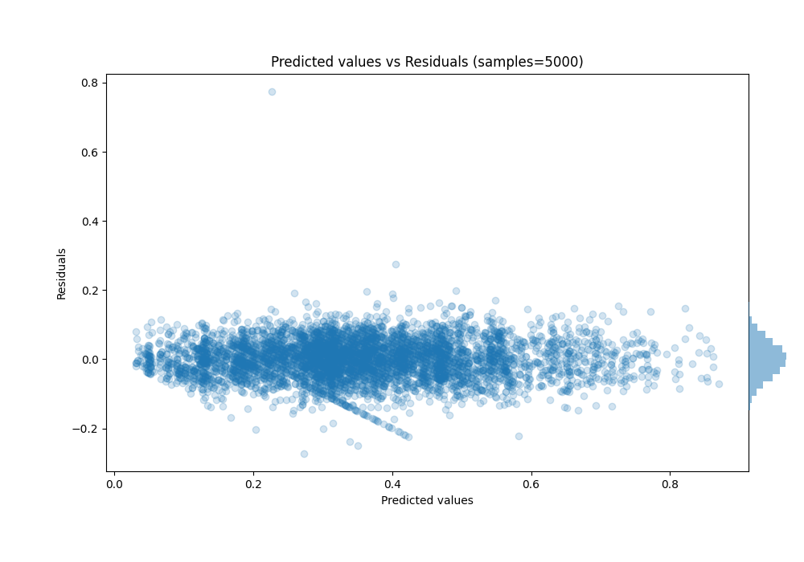

# Summary of 61_CatBoost

[<< Go back](../README.md)

## CatBoost
- **n_jobs**: -1
- **learning_rate**: 0.1
- **depth**: 7
- **rsm**: 0.9
- **loss_function**: RMSE
- **eval_metric**: RMSE
- **explain_level**: 0

## Validation
 - **validation_type**: split
 - **train_ratio**: 0.8
 - **shuffle**: True

## Optimized metric
rmse

## Training time

74.9 seconds

### Metric details:
| Metric   |      Score |
|:---------|-----------:|
| MAE      | 0.0435214  |
| MSE      | 0.00313589 |
| RMSE     | 0.055999   |
| R2       | 0.886958   |
| MAPE     | 1.072e+12  |

## Learning curves

## True vs Predicted

## Predicted vs Residuals

[<< Go back](../README.md)
