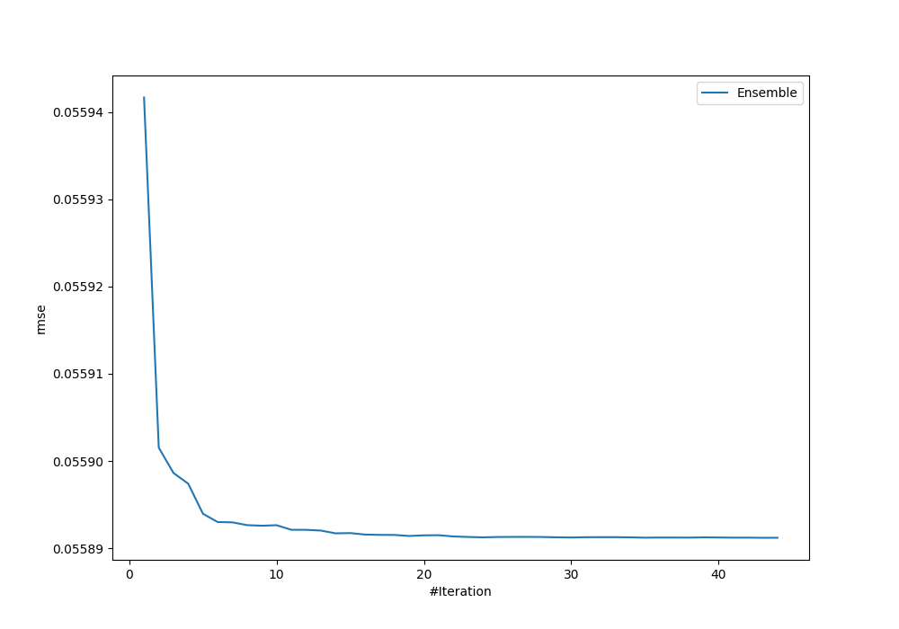
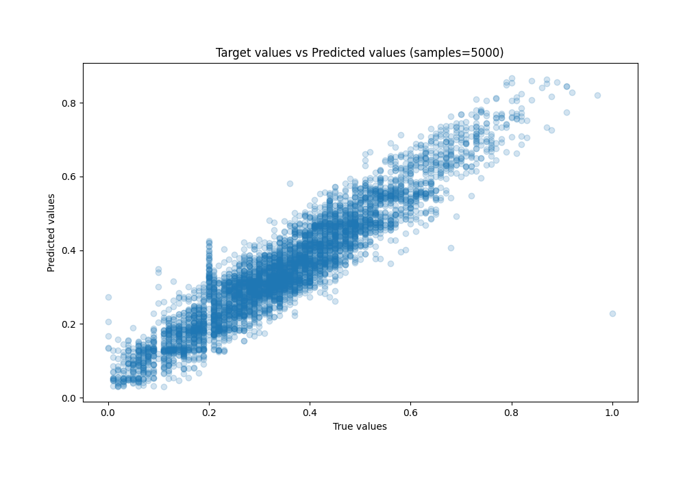
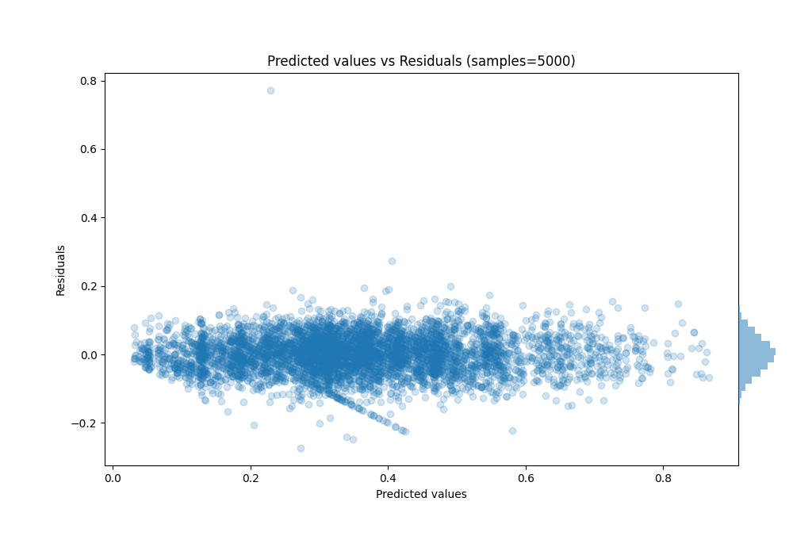

# Summary of Ensemble

[<< Go back](../README.md)

## Ensemble structure
| Model              |   Weight |
|:-------------------|---------:|
| 10_Xgboost         |        9 |
| 12_Xgboost         |        3 |
| 19_LightGBM        |        1 |
| 20_LightGBM        |        1 |
| 22_LightGBM        |        5 |
| 23_LightGBM        |        2 |
| 30_CatBoost        |        9 |
| 31_CatBoost        |        2 |
| 4_Default_LightGBM |        2 |
| 60_Xgboost         |        7 |
| 64_CatBoost        |        2 |

### Metric details:
| Metric   |       Score |
|:---------|------------:|
| MAE      | 0.0433935   |
| MSE      | 0.00312383  |
| RMSE     | 0.0558912   |
| R2       | 0.887393    |
| MAPE     | 1.07214e+12 |

## Learning curves

## True vs Predicted

## Predicted vs Residuals

[<< Go back](../README.md)
