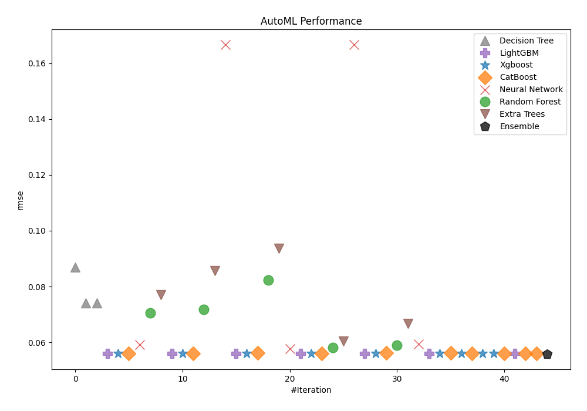
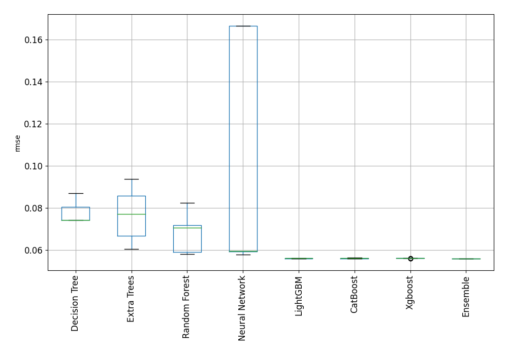
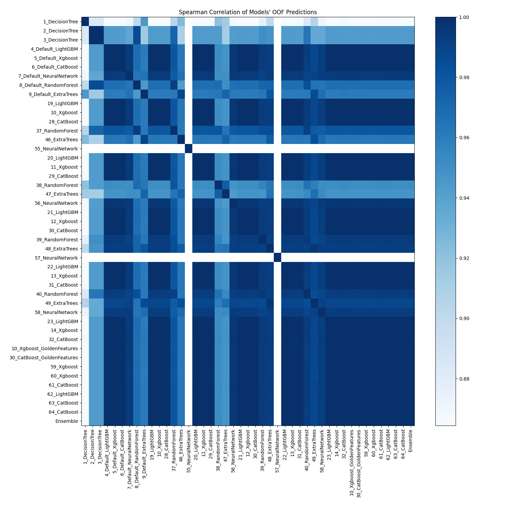

# AutoML Leaderboard

| Best model   | name                                                               | model_type     | metric_type   |   metric_value |   train_time |
|:-------------|:-------------------------------------------------------------------|:---------------|:--------------|---------------:|-------------:|
|              | [1_DecisionTree](1_DecisionTree/README.md)                         | Decision Tree  | rmse          |      0.0868677 |         2.72 |
|              | [2_DecisionTree](2_DecisionTree/README.md)                         | Decision Tree  | rmse          |      0.0740509 |         2.74 |
|              | [3_DecisionTree](3_DecisionTree/README.md)                         | Decision Tree  | rmse          |      0.0740509 |         2.72 |
|              | [4_Default_LightGBM](4_Default_LightGBM/README.md)                 | LightGBM       | rmse          |      0.0559537 |         4.17 |
|              | [5_Default_Xgboost](5_Default_Xgboost/README.md)                   | Xgboost        | rmse          |      0.0560121 |         4.84 |
|              | [6_Default_CatBoost](6_Default_CatBoost/README.md)                 | CatBoost       | rmse          |      0.0559684 |       172.62 |
|              | [7_Default_NeuralNetwork](7_Default_NeuralNetwork/README.md)       | Neural Network | rmse          |      0.0591929 |         7.13 |
|              | [8_Default_RandomForest](8_Default_RandomForest/README.md)         | Random Forest  | rmse          |      0.0705605 |        16.42 |
|              | [9_Default_ExtraTrees](9_Default_ExtraTrees/README.md)             | Extra Trees    | rmse          |      0.0770785 |        60.21 |
|              | [19_LightGBM](19_LightGBM/README.md)                               | LightGBM       | rmse          |      0.0559965 |         7.43 |
|              | [10_Xgboost](10_Xgboost/README.md)                                 | Xgboost        | rmse          |      0.0559417 |         3.52 |
|              | [28_CatBoost](28_CatBoost/README.md)                               | CatBoost       | rmse          |      0.0559529 |       190.06 |
|              | [37_RandomForest](37_RandomForest/README.md)                       | Random Forest  | rmse          |      0.0718042 |        55.87 |
|              | [46_ExtraTrees](46_ExtraTrees/README.md)                           | Extra Trees    | rmse          |      0.0856319 |        17.11 |
|              | [55_NeuralNetwork](55_NeuralNetwork/README.md)                     | Neural Network | rmse          |      0.166569  |         5.92 |
|              | [20_LightGBM](20_LightGBM/README.md)                               | LightGBM       | rmse          |      0.0560824 |         3.47 |
|              | [11_Xgboost](11_Xgboost/README.md)                                 | Xgboost        | rmse          |      0.0559978 |         3.45 |
|              | [29_CatBoost](29_CatBoost/README.md)                               | CatBoost       | rmse          |      0.0561894 |        72.65 |
|              | [38_RandomForest](38_RandomForest/README.md)                       | Random Forest  | rmse          |      0.0823404 |        31.85 |
|              | [47_ExtraTrees](47_ExtraTrees/README.md)                           | Extra Trees    | rmse          |      0.0935812 |        14.29 |
|              | [56_NeuralNetwork](56_NeuralNetwork/README.md)                     | Neural Network | rmse          |      0.0577008 |         9.11 |
|              | [21_LightGBM](21_LightGBM/README.md)                               | LightGBM       | rmse          |      0.0559629 |         4.19 |
|              | [12_Xgboost](12_Xgboost/README.md)                                 | Xgboost        | rmse          |      0.0560173 |         4.1  |
|              | [30_CatBoost](30_CatBoost/README.md)                               | CatBoost       | rmse          |      0.0559515 |       132.34 |
|              | [39_RandomForest](39_RandomForest/README.md)                       | Random Forest  | rmse          |      0.0580238 |        18.26 |
|              | [48_ExtraTrees](48_ExtraTrees/README.md)                           | Extra Trees    | rmse          |      0.0604346 |        51.19 |
|              | [57_NeuralNetwork](57_NeuralNetwork/README.md)                     | Neural Network | rmse          |      0.166558  |        14.83 |
|              | [22_LightGBM](22_LightGBM/README.md)                               | LightGBM       | rmse          |      0.0559527 |         3.95 |
|              | [13_Xgboost](13_Xgboost/README.md)                                 | Xgboost        | rmse          |      0.0561052 |         3.72 |
|              | [31_CatBoost](31_CatBoost/README.md)                               | CatBoost       | rmse          |      0.0561914 |        54.31 |
|              | [40_RandomForest](40_RandomForest/README.md)                       | Random Forest  | rmse          |      0.0590503 |        24.08 |
|              | [49_ExtraTrees](49_ExtraTrees/README.md)                           | Extra Trees    | rmse          |      0.0667609 |        30.06 |
|              | [58_NeuralNetwork](58_NeuralNetwork/README.md)                     | Neural Network | rmse          |      0.059379  |         7.08 |
|              | [23_LightGBM](23_LightGBM/README.md)                               | LightGBM       | rmse          |      0.0560828 |         3.81 |
|              | [14_Xgboost](14_Xgboost/README.md)                                 | Xgboost        | rmse          |      0.0560094 |         4.16 |
|              | [32_CatBoost](32_CatBoost/README.md)                               | CatBoost       | rmse          |      0.0562532 |       154.62 |
|              | [10_Xgboost_GoldenFeatures](10_Xgboost_GoldenFeatures/README.md)   | Xgboost        | rmse          |      0.0560393 |         7.08 |
|              | [30_CatBoost_GoldenFeatures](30_CatBoost_GoldenFeatures/README.md) | CatBoost       | rmse          |      0.056012  |       112.36 |
|              | [59_Xgboost](59_Xgboost/README.md)                                 | Xgboost        | rmse          |      0.0559497 |         4.16 |
|              | [60_Xgboost](60_Xgboost/README.md)                                 | Xgboost        | rmse          |      0.0559922 |         3.77 |
|              | [61_CatBoost](61_CatBoost/README.md)                               | CatBoost       | rmse          |      0.055999  |        75.22 |
|              | [62_LightGBM](62_LightGBM/README.md)                               | LightGBM       | rmse          |      0.0559607 |         3.47 |
|              | [63_CatBoost](63_CatBoost/README.md)                               | CatBoost       | rmse          |      0.0559733 |       167.78 |
|              | [64_CatBoost](64_CatBoost/README.md)                               | CatBoost       | rmse          |      0.0559515 |       220.1  |
| **the best** | [Ensemble](Ensemble/README.md)                                     | Ensemble       | rmse          |      0.0558912 |         2.17 |

### AutoML Performance

### AutoML Performance Boxplot

### Spearman Correlation of Models

