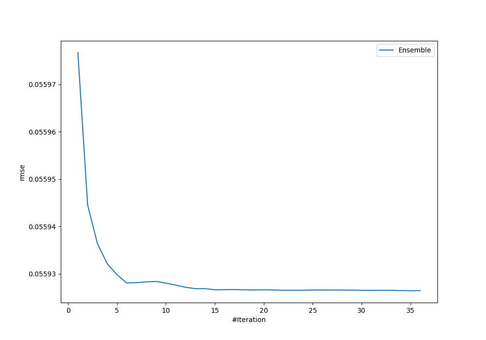
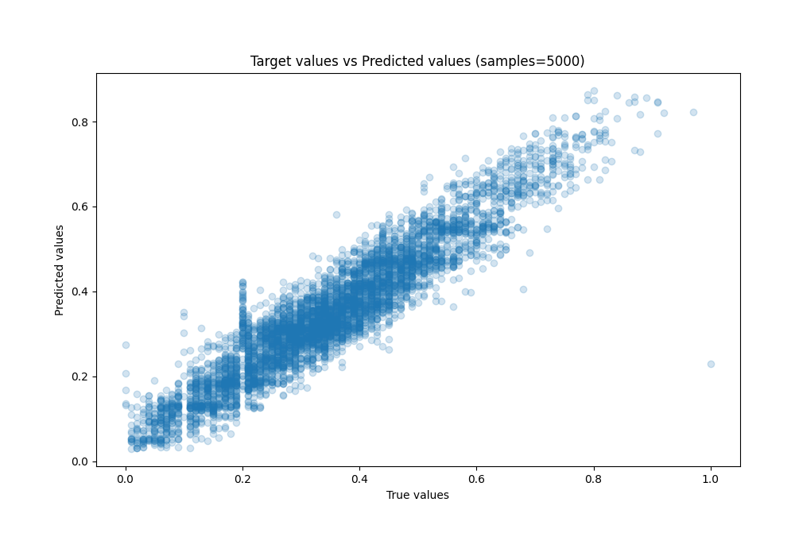
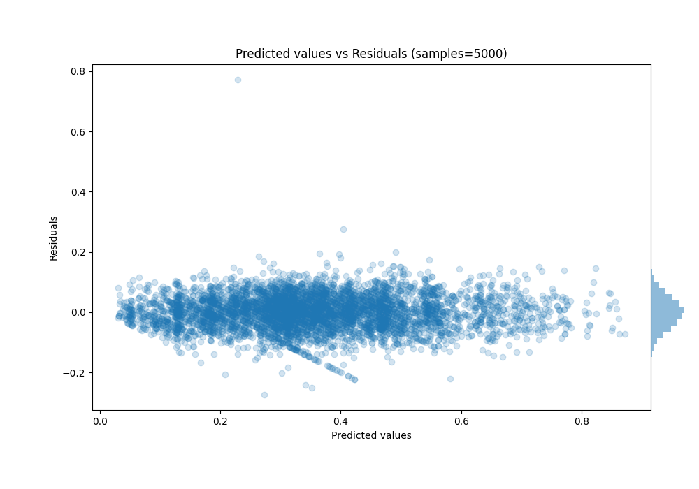

# Summary of Ensemble

[<< Go back](../README.md)

## Ensemble structure
| Model                      |   Weight |
|:---------------------------|---------:|
| 14_LightGBM                |        4 |
| 17_LightGBM                |        1 |
| 19_LightGBM                |        5 |
| 1_Default_LightGBM         |        5 |
| 25_CatBoost                |        9 |
| 25_CatBoost_GoldenFeatures |        2 |
| 26_CatBoost                |        2 |
| 5_Xgboost                  |        6 |
| 9_Xgboost                  |        1 |

### Metric details:
| Metric   |       Score |
|:---------|------------:|
| MAE      | 0.0434139   |
| MSE      | 0.00312777  |
| RMSE     | 0.0559264   |
| R2       | 0.887251    |
| MAPE     | 1.07326e+12 |

## Learning curves

## True vs Predicted

## Predicted vs Residuals

[<< Go back](../README.md)
