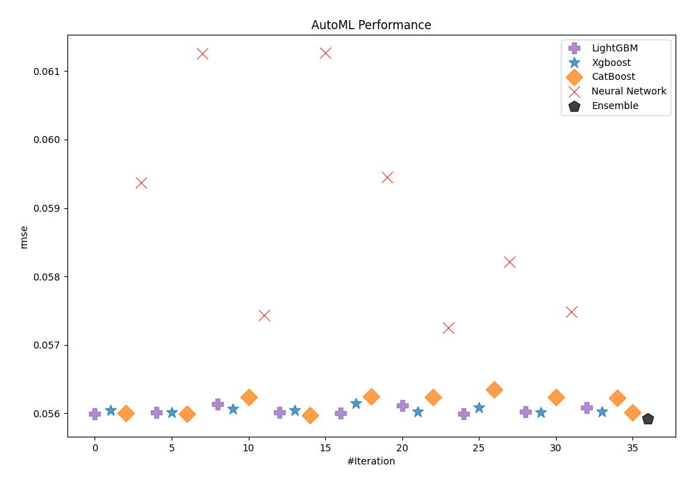
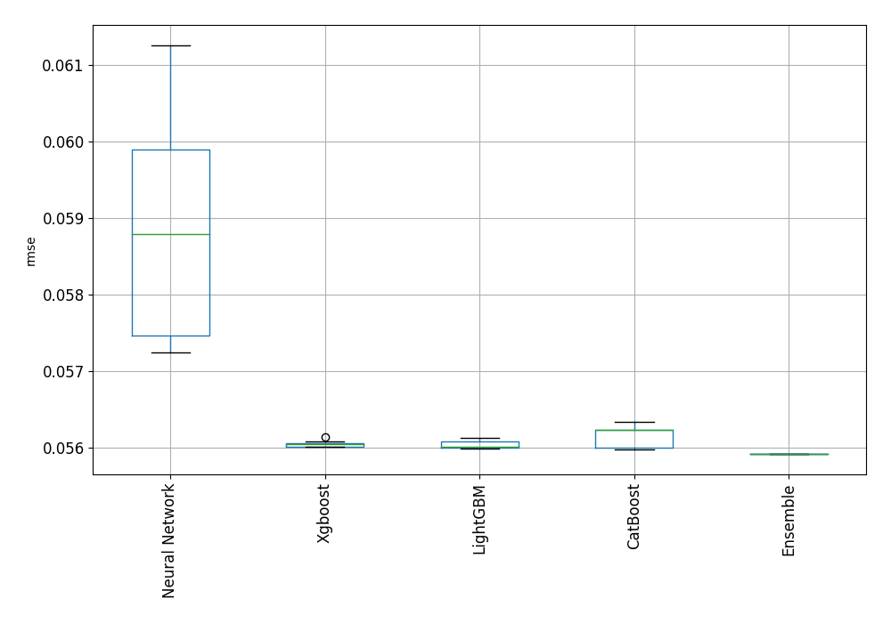
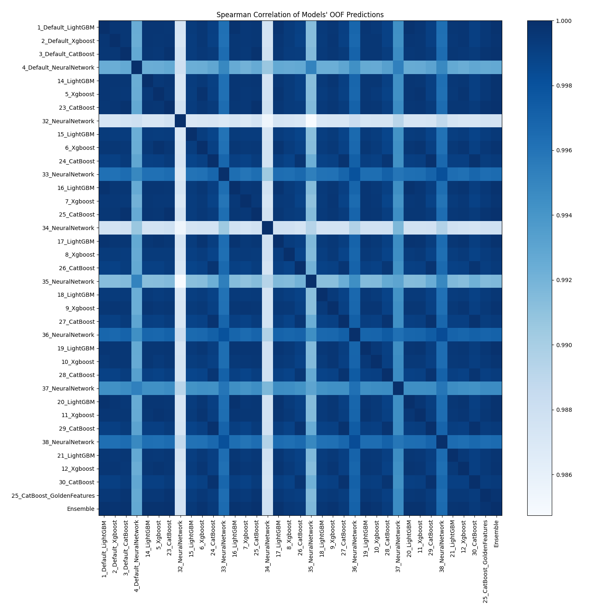

# AutoML Leaderboard

| Best model   | name                                                               | model_type     | metric_type   |   metric_value |   train_time |
|:-------------|:-------------------------------------------------------------------|:---------------|:--------------|---------------:|-------------:|
|              | [1_Default_LightGBM](1_Default_LightGBM/README.md)                 | LightGBM       | rmse          |      0.0559968 |         5.56 |
|              | [2_Default_Xgboost](2_Default_Xgboost/README.md)                   | Xgboost        | rmse          |      0.0560472 |         4.7  |
|              | [3_Default_CatBoost](3_Default_CatBoost/README.md)                 | CatBoost       | rmse          |      0.0560046 |       104.66 |
|              | [4_Default_NeuralNetwork](4_Default_NeuralNetwork/README.md)       | Neural Network | rmse          |      0.0593749 |        14.33 |
|              | [14_LightGBM](14_LightGBM/README.md)                               | LightGBM       | rmse          |      0.0560101 |         9.05 |
|              | [5_Xgboost](5_Xgboost/README.md)                                   | Xgboost        | rmse          |      0.0560121 |         4.51 |
|              | [23_CatBoost](23_CatBoost/README.md)                               | CatBoost       | rmse          |      0.0559959 |       156.99 |
|              | [32_NeuralNetwork](32_NeuralNetwork/README.md)                     | Neural Network | rmse          |      0.061256  |         7.73 |
|              | [15_LightGBM](15_LightGBM/README.md)                               | LightGBM       | rmse          |      0.0561369 |         4.03 |
|              | [6_Xgboost](6_Xgboost/README.md)                                   | Xgboost        | rmse          |      0.0560617 |         3.96 |
|              | [24_CatBoost](24_CatBoost/README.md)                               | CatBoost       | rmse          |      0.0562421 |        70.22 |
|              | [33_NeuralNetwork](33_NeuralNetwork/README.md)                     | Neural Network | rmse          |      0.0574308 |        13.63 |
|              | [16_LightGBM](16_LightGBM/README.md)                               | LightGBM       | rmse          |      0.0560149 |         5.39 |
|              | [7_Xgboost](7_Xgboost/README.md)                                   | Xgboost        | rmse          |      0.0560476 |         4.98 |
|              | [25_CatBoost](25_CatBoost/README.md)                               | CatBoost       | rmse          |      0.0559767 |       106.25 |
|              | [34_NeuralNetwork](34_NeuralNetwork/README.md)                     | Neural Network | rmse          |      0.0612621 |        14.75 |
|              | [17_LightGBM](17_LightGBM/README.md)                               | LightGBM       | rmse          |      0.0560075 |         4.67 |
|              | [8_Xgboost](8_Xgboost/README.md)                                   | Xgboost        | rmse          |      0.056143  |         4.05 |
|              | [26_CatBoost](26_CatBoost/README.md)                               | CatBoost       | rmse          |      0.056248  |        47.93 |
|              | [35_NeuralNetwork](35_NeuralNetwork/README.md)                     | Neural Network | rmse          |      0.0594494 |         8.73 |
|              | [18_LightGBM](18_LightGBM/README.md)                               | LightGBM       | rmse          |      0.0561156 |         4.11 |
|              | [9_Xgboost](9_Xgboost/README.md)                                   | Xgboost        | rmse          |      0.0560253 |         5.93 |
|              | [27_CatBoost](27_CatBoost/README.md)                               | CatBoost       | rmse          |      0.0562383 |       115.22 |
|              | [36_NeuralNetwork](36_NeuralNetwork/README.md)                     | Neural Network | rmse          |      0.0572509 |        13.84 |
|              | [19_LightGBM](19_LightGBM/README.md)                               | LightGBM       | rmse          |      0.0559943 |         5.48 |
|              | [10_Xgboost](10_Xgboost/README.md)                                 | Xgboost        | rmse          |      0.0560851 |         7.63 |
|              | [28_CatBoost](28_CatBoost/README.md)                               | CatBoost       | rmse          |      0.056345  |       136.8  |
|              | [37_NeuralNetwork](37_NeuralNetwork/README.md)                     | Neural Network | rmse          |      0.0582128 |        13.21 |
|              | [20_LightGBM](20_LightGBM/README.md)                               | LightGBM       | rmse          |      0.0560229 |         5.38 |
|              | [11_Xgboost](11_Xgboost/README.md)                                 | Xgboost        | rmse          |      0.0560164 |         4.88 |
|              | [29_CatBoost](29_CatBoost/README.md)                               | CatBoost       | rmse          |      0.056241  |       209.8  |
|              | [38_NeuralNetwork](38_NeuralNetwork/README.md)                     | Neural Network | rmse          |      0.0574875 |        12.26 |
|              | [21_LightGBM](21_LightGBM/README.md)                               | LightGBM       | rmse          |      0.0560868 |         4.36 |
|              | [12_Xgboost](12_Xgboost/README.md)                                 | Xgboost        | rmse          |      0.0560213 |         4.18 |
|              | [30_CatBoost](30_CatBoost/README.md)                               | CatBoost       | rmse          |      0.0562261 |       115.92 |
|              | [25_CatBoost_GoldenFeatures](25_CatBoost_GoldenFeatures/README.md) | CatBoost       | rmse          |      0.0560139 |      2230.13 |
| **the best** | [Ensemble](Ensemble/README.md)                                     | Ensemble       | rmse          |      0.0559264 |         1.42 |

### AutoML Performance

### AutoML Performance Boxplot

### Spearman Correlation of Models

