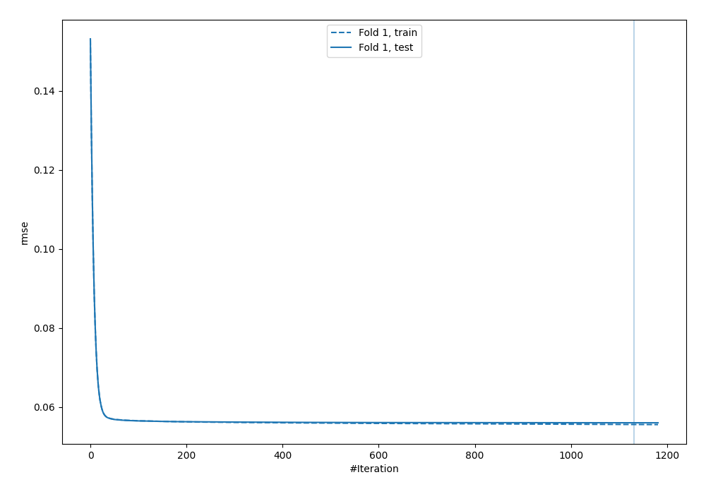
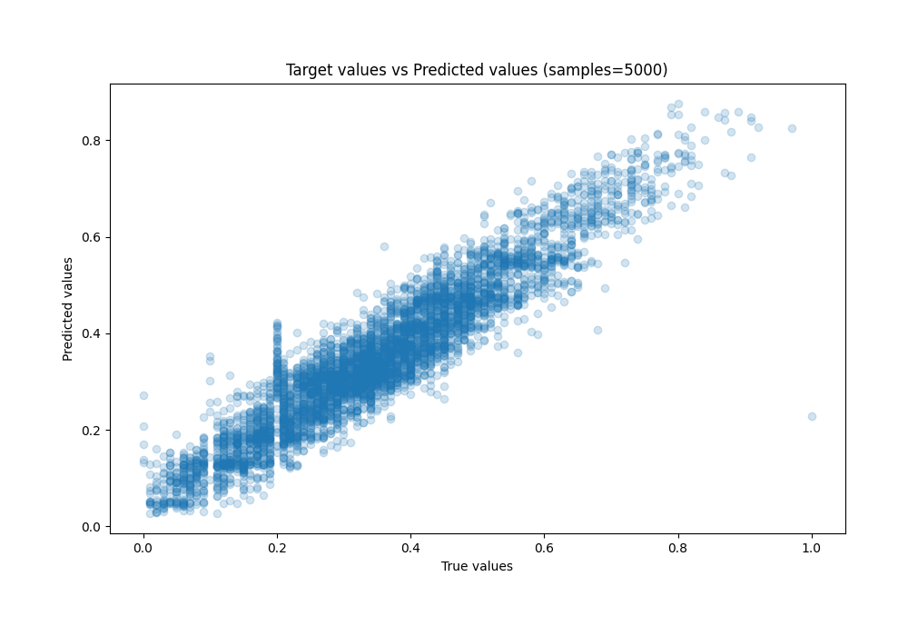
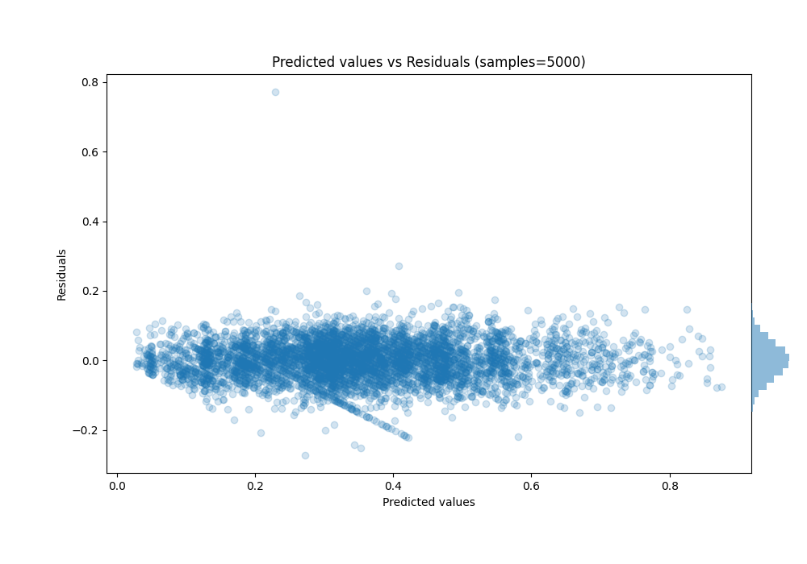

# Summary of 43_CatBoost

[<< Go back](../README.md)

## CatBoost
- **n_jobs**: -1
- **learning_rate**: 0.1
- **depth**: 6
- **rsm**: 1.0
- **loss_function**: RMSE
- **eval_metric**: RMSE
- **explain_level**: 0

## Validation
 - **validation_type**: split
 - **train_ratio**: 0.8
 - **shuffle**: True

## Optimized metric
rmse

## Training time

107.0 seconds

### Metric details:
| Metric   |      Score |
|:---------|-----------:|
| MAE      | 0.0435044  |
| MSE      | 0.00313435 |
| RMSE     | 0.0559853  |
| R2       | 0.887013   |
| MAPE     | 1.073e+12  |

## Learning curves

## True vs Predicted

## Predicted vs Residuals

[<< Go back](../README.md)
