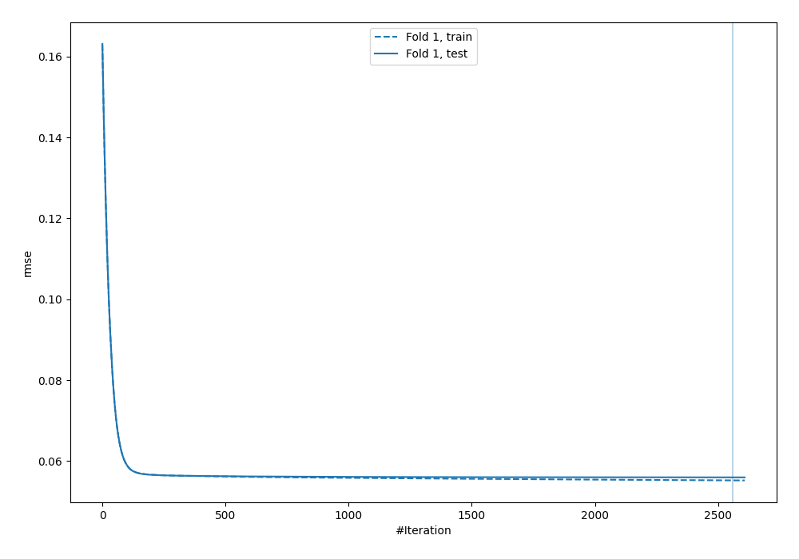
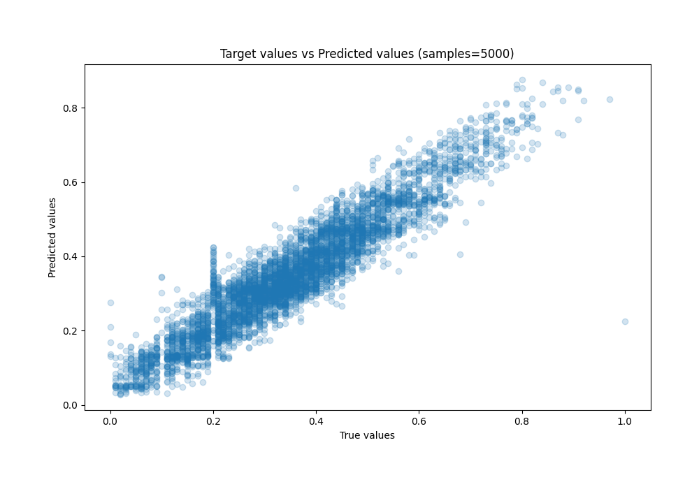
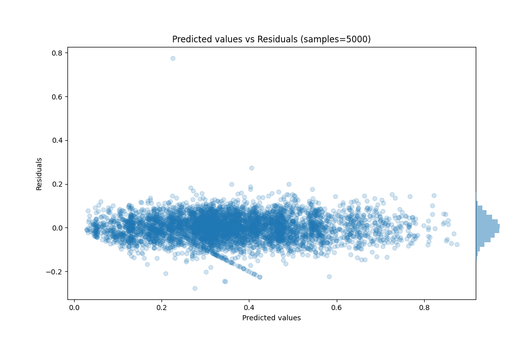

# Summary of 46_CatBoost_GoldenFeatures

[<< Go back](../README.md)

## CatBoost
- **n_jobs**: -1
- **learning_rate**: 0.025
- **depth**: 8
- **rsm**: 0.7
- **loss_function**: RMSE
- **eval_metric**: RMSE
- **explain_level**: 0

## Validation
 - **validation_type**: split
 - **train_ratio**: 0.8
 - **shuffle**: True

## Optimized metric
rmse

## Training time

330.2 seconds

### Metric details:
| Metric   |       Score |
|:---------|------------:|
| MAE      | 0.0434789   |
| MSE      | 0.00313429  |
| RMSE     | 0.0559847   |
| R2       | 0.887016    |
| MAPE     | 1.07507e+12 |

## Learning curves

## True vs Predicted

## Predicted vs Residuals

[<< Go back](../README.md)
