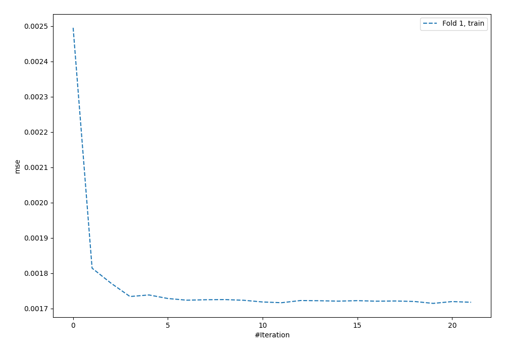
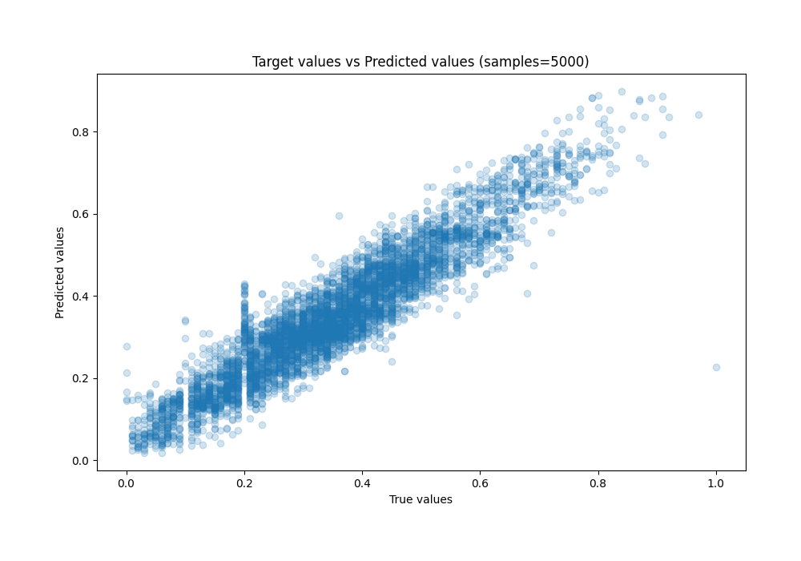
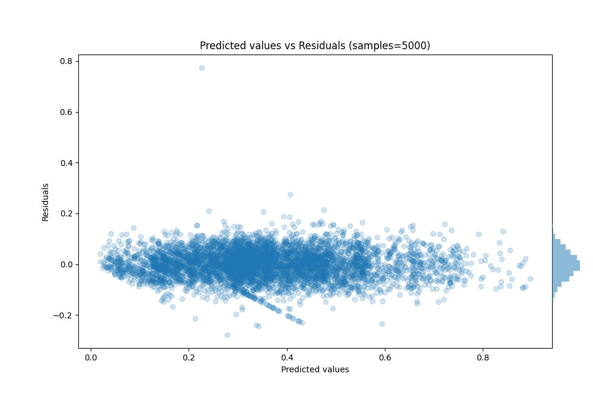

# Summary of 58_NeuralNetwork

[<< Go back](../README.md)

## Neural Network
- **n_jobs**: -1
- **dense_1_size**: 64
- **dense_2_size**: 8
- **learning_rate**: 0.01
- **explain_level**: 0

## Validation
 - **validation_type**: split
 - **train_ratio**: 0.8
 - **shuffle**: True

## Optimized metric
rmse

## Training time

11.1 seconds

### Metric details:
| Metric   |       Score |
|:---------|------------:|
| MAE      | 0.0446006   |
| MSE      | 0.00329877  |
| RMSE     | 0.0574349   |
| R2       | 0.881087    |
| MAPE     | 1.06348e+12 |

## Learning curves

## True vs Predicted

## Predicted vs Residuals

[<< Go back](../README.md)
