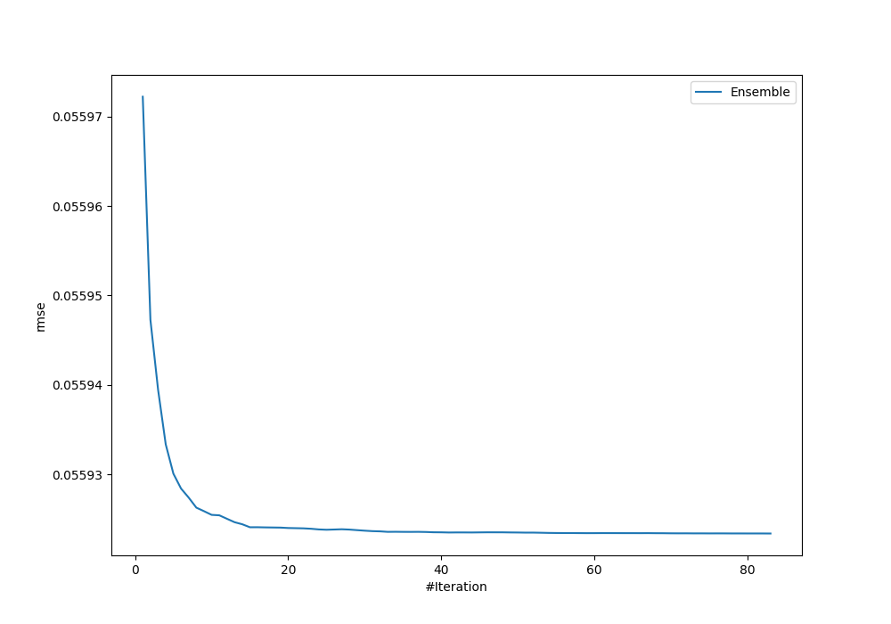
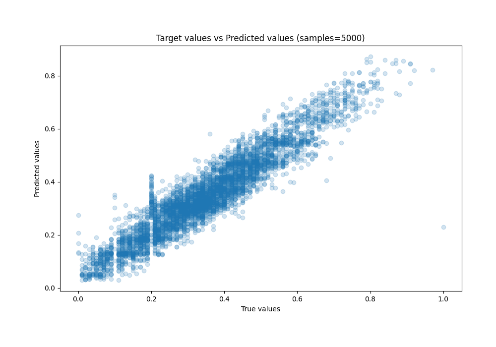
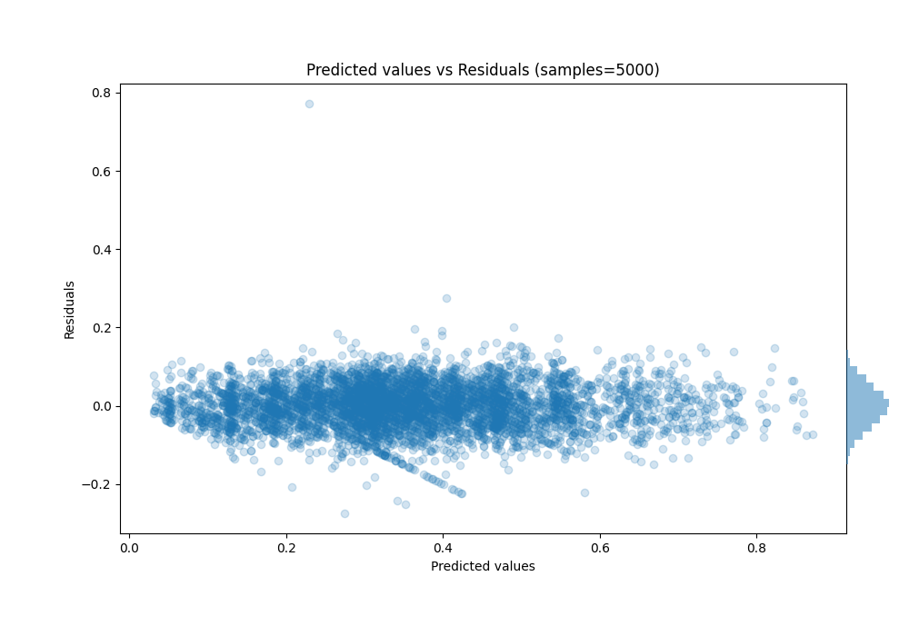

# Summary of Ensemble

[<< Go back](../README.md)

## Ensemble structure
| Model                      |   Weight |
|:---------------------------|---------:|
| 14_LightGBM                |       10 |
| 19_LightGBM                |        7 |
| 19_LightGBM_GoldenFeatures |        6 |
| 1_Default_LightGBM         |       10 |
| 25_CatBoost                |       13 |
| 26_CatBoost                |        2 |
| 29_CatBoost                |        2 |
| 31_CatBoost                |        1 |
| 44_CatBoost                |        8 |
| 53_Xgboost                 |        6 |
| 55_Xgboost                 |        5 |
| 5_Xgboost                  |        5 |
| 63_CatBoost                |        6 |
| 74_Xgboost                 |        1 |
| 9_Xgboost                  |        1 |

### Metric details:
| Metric   |       Score |
|:---------|------------:|
| MAE      | 0.0434114   |
| MSE      | 0.00312743  |
| RMSE     | 0.0559234   |
| R2       | 0.887263    |
| MAPE     | 1.07311e+12 |

## Learning curves

## True vs Predicted

## Predicted vs Residuals

[<< Go back](../README.md)
