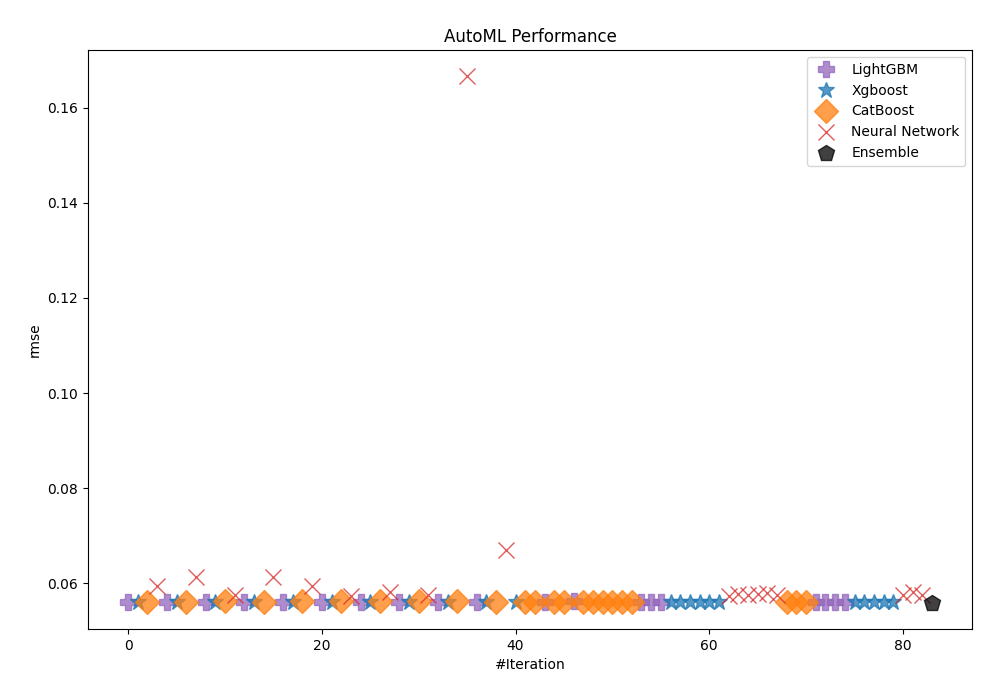
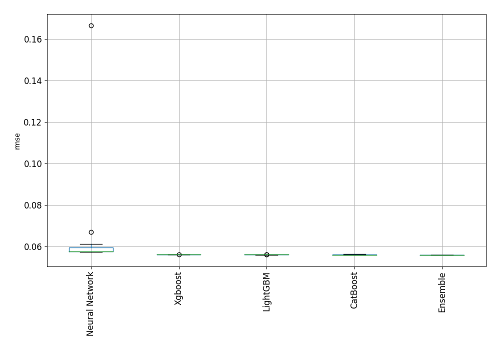
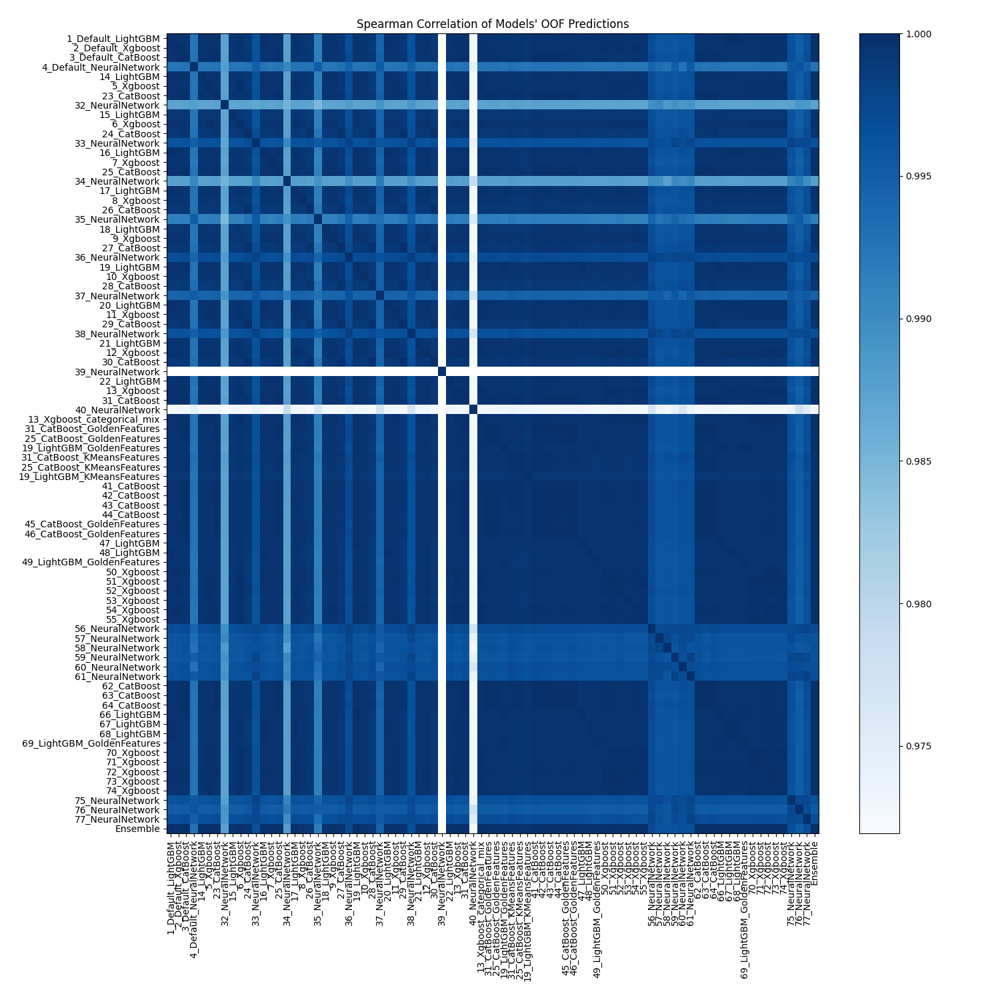

# AutoML Leaderboard

| Best model   | name                                                               | model_type     | metric_type   |   metric_value |   train_time |
|:-------------|:-------------------------------------------------------------------|:---------------|:--------------|---------------:|-------------:|
|              | [1_Default_LightGBM](1_Default_LightGBM/README.md)                 | LightGBM       | rmse          |      0.0559968 |         5.98 |
|              | [2_Default_Xgboost](2_Default_Xgboost/README.md)                   | Xgboost        | rmse          |      0.0560472 |         5.04 |
|              | [3_Default_CatBoost](3_Default_CatBoost/README.md)                 | CatBoost       | rmse          |      0.0560046 |       109.11 |
|              | [4_Default_NeuralNetwork](4_Default_NeuralNetwork/README.md)       | Neural Network | rmse          |      0.0593749 |        14.37 |
|              | [14_LightGBM](14_LightGBM/README.md)                               | LightGBM       | rmse          |      0.0560101 |         9.39 |
|              | [5_Xgboost](5_Xgboost/README.md)                                   | Xgboost        | rmse          |      0.0560121 |         4.25 |
|              | [23_CatBoost](23_CatBoost/README.md)                               | CatBoost       | rmse          |      0.0559959 |       158.16 |
|              | [32_NeuralNetwork](32_NeuralNetwork/README.md)                     | Neural Network | rmse          |      0.061256  |         7.84 |
|              | [15_LightGBM](15_LightGBM/README.md)                               | LightGBM       | rmse          |      0.0561369 |         4.59 |
|              | [6_Xgboost](6_Xgboost/README.md)                                   | Xgboost        | rmse          |      0.0560617 |         4.1  |
|              | [24_CatBoost](24_CatBoost/README.md)                               | CatBoost       | rmse          |      0.0562421 |        71.3  |
|              | [33_NeuralNetwork](33_NeuralNetwork/README.md)                     | Neural Network | rmse          |      0.0574308 |        14.04 |
|              | [16_LightGBM](16_LightGBM/README.md)                               | LightGBM       | rmse          |      0.0560149 |         5.36 |
|              | [7_Xgboost](7_Xgboost/README.md)                                   | Xgboost        | rmse          |      0.0560476 |         5.02 |
|              | [25_CatBoost](25_CatBoost/README.md)                               | CatBoost       | rmse          |      0.0559767 |       106.43 |
|              | [34_NeuralNetwork](34_NeuralNetwork/README.md)                     | Neural Network | rmse          |      0.0612621 |        14.6  |
|              | [17_LightGBM](17_LightGBM/README.md)                               | LightGBM       | rmse          |      0.0560075 |         4.67 |
|              | [8_Xgboost](8_Xgboost/README.md)                                   | Xgboost        | rmse          |      0.056143  |         4.13 |
|              | [26_CatBoost](26_CatBoost/README.md)                               | CatBoost       | rmse          |      0.056248  |        48.65 |
|              | [35_NeuralNetwork](35_NeuralNetwork/README.md)                     | Neural Network | rmse          |      0.0594494 |         8.96 |
|              | [18_LightGBM](18_LightGBM/README.md)                               | LightGBM       | rmse          |      0.0561156 |         4.21 |
|              | [9_Xgboost](9_Xgboost/README.md)                                   | Xgboost        | rmse          |      0.0560253 |         5.48 |
|              | [27_CatBoost](27_CatBoost/README.md)                               | CatBoost       | rmse          |      0.0562383 |       115.18 |
|              | [36_NeuralNetwork](36_NeuralNetwork/README.md)                     | Neural Network | rmse          |      0.0572509 |        13.86 |
|              | [19_LightGBM](19_LightGBM/README.md)                               | LightGBM       | rmse          |      0.0559943 |         5.9  |
|              | [10_Xgboost](10_Xgboost/README.md)                                 | Xgboost        | rmse          |      0.0560851 |         7.18 |
|              | [28_CatBoost](28_CatBoost/README.md)                               | CatBoost       | rmse          |      0.0563434 |       142.99 |
|              | [37_NeuralNetwork](37_NeuralNetwork/README.md)                     | Neural Network | rmse          |      0.0582128 |        13.31 |
|              | [20_LightGBM](20_LightGBM/README.md)                               | LightGBM       | rmse          |      0.0560229 |         5.52 |
|              | [11_Xgboost](11_Xgboost/README.md)                                 | Xgboost        | rmse          |      0.0560164 |         5.41 |
|              | [29_CatBoost](29_CatBoost/README.md)                               | CatBoost       | rmse          |      0.0561969 |       457.55 |
|              | [38_NeuralNetwork](38_NeuralNetwork/README.md)                     | Neural Network | rmse          |      0.0574875 |        12.48 |
|              | [21_LightGBM](21_LightGBM/README.md)                               | LightGBM       | rmse          |      0.0560868 |         4.39 |
|              | [12_Xgboost](12_Xgboost/README.md)                                 | Xgboost        | rmse          |      0.0560213 |         4.55 |
|              | [30_CatBoost](30_CatBoost/README.md)                               | CatBoost       | rmse          |      0.0562261 |       119.66 |
|              | [39_NeuralNetwork](39_NeuralNetwork/README.md)                     | Neural Network | rmse          |      0.166567  |         7.58 |
|              | [22_LightGBM](22_LightGBM/README.md)                               | LightGBM       | rmse          |      0.0560572 |         7.35 |
|              | [13_Xgboost](13_Xgboost/README.md)                                 | Xgboost        | rmse          |      0.0560043 |         6.34 |
|              | [31_CatBoost](31_CatBoost/README.md)                               | CatBoost       | rmse          |      0.0559722 |       395.87 |
|              | [40_NeuralNetwork](40_NeuralNetwork/README.md)                     | Neural Network | rmse          |      0.0669526 |         9.8  |
|              | [13_Xgboost_categorical_mix](13_Xgboost_categorical_mix/README.md) | Xgboost        | rmse          |      0.0560139 |         5.2  |
|              | [31_CatBoost_GoldenFeatures](31_CatBoost_GoldenFeatures/README.md) | CatBoost       | rmse          |      0.0559817 |       358.76 |
|              | [25_CatBoost_GoldenFeatures](25_CatBoost_GoldenFeatures/README.md) | CatBoost       | rmse          |      0.0560139 |        93.2  |
|              | [19_LightGBM_GoldenFeatures](19_LightGBM_GoldenFeatures/README.md) | LightGBM       | rmse          |      0.056003  |         7.36 |
|              | [31_CatBoost_KMeansFeatures](31_CatBoost_KMeansFeatures/README.md) | CatBoost       | rmse          |      0.056086  |       285.83 |
|              | [25_CatBoost_KMeansFeatures](25_CatBoost_KMeansFeatures/README.md) | CatBoost       | rmse          |      0.0560688 |       109.96 |
|              | [19_LightGBM_KMeansFeatures](19_LightGBM_KMeansFeatures/README.md) | LightGBM       | rmse          |      0.0561769 |         8.63 |
|              | [41_CatBoost](41_CatBoost/README.md)                               | CatBoost       | rmse          |      0.0559893 |       392.56 |
|              | [42_CatBoost](42_CatBoost/README.md)                               | CatBoost       | rmse          |      0.0559742 |       345.71 |
|              | [43_CatBoost](43_CatBoost/README.md)                               | CatBoost       | rmse          |      0.0559853 |       107.29 |
|              | [44_CatBoost](44_CatBoost/README.md)                               | CatBoost       | rmse          |      0.0559846 |        89.32 |
|              | [45_CatBoost_GoldenFeatures](45_CatBoost_GoldenFeatures/README.md) | CatBoost       | rmse          |      0.0559929 |       468.82 |
|              | [46_CatBoost_GoldenFeatures](46_CatBoost_GoldenFeatures/README.md) | CatBoost       | rmse          |      0.0559847 |       330.51 |
|              | [47_LightGBM](47_LightGBM/README.md)                               | LightGBM       | rmse          |      0.0560513 |         4.86 |
|              | [48_LightGBM](48_LightGBM/README.md)                               | LightGBM       | rmse          |      0.0560363 |         4.81 |
|              | [49_LightGBM_GoldenFeatures](49_LightGBM_GoldenFeatures/README.md) | LightGBM       | rmse          |      0.0560496 |         6    |
|              | [50_Xgboost](50_Xgboost/README.md)                                 | Xgboost        | rmse          |      0.0560332 |         6.54 |
|              | [51_Xgboost](51_Xgboost/README.md)                                 | Xgboost        | rmse          |      0.0560262 |         5.3  |
|              | [52_Xgboost](52_Xgboost/README.md)                                 | Xgboost        | rmse          |      0.0560393 |         4.74 |
|              | [53_Xgboost](53_Xgboost/README.md)                                 | Xgboost        | rmse          |      0.0560523 |         4.61 |
|              | [54_Xgboost](54_Xgboost/README.md)                                 | Xgboost        | rmse          |      0.0560264 |         7.25 |
|              | [55_Xgboost](55_Xgboost/README.md)                                 | Xgboost        | rmse          |      0.0560042 |         5.38 |
|              | [56_NeuralNetwork](56_NeuralNetwork/README.md)                     | Neural Network | rmse          |      0.0573504 |        20.09 |
|              | [57_NeuralNetwork](57_NeuralNetwork/README.md)                     | Neural Network | rmse          |      0.0576724 |        18.24 |
|              | [58_NeuralNetwork](58_NeuralNetwork/README.md)                     | Neural Network | rmse          |      0.0574349 |        11.35 |
|              | [59_NeuralNetwork](59_NeuralNetwork/README.md)                     | Neural Network | rmse          |      0.057673  |        16.88 |
|              | [60_NeuralNetwork](60_NeuralNetwork/README.md)                     | Neural Network | rmse          |      0.0578763 |         8.78 |
|              | [61_NeuralNetwork](61_NeuralNetwork/README.md)                     | Neural Network | rmse          |      0.0575256 |        10.18 |
|              | [62_CatBoost](62_CatBoost/README.md)                               | CatBoost       | rmse          |      0.0559849 |       161.6  |
|              | [63_CatBoost](63_CatBoost/README.md)                               | CatBoost       | rmse          |      0.0559795 |       211.05 |
|              | [64_CatBoost](64_CatBoost/README.md)                               | CatBoost       | rmse          |      0.0559836 |       177.03 |
|              | [66_LightGBM](66_LightGBM/README.md)                               | LightGBM       | rmse          |      0.0559943 |         5.92 |
|              | [67_LightGBM](67_LightGBM/README.md)                               | LightGBM       | rmse          |      0.0559968 |         6.05 |
|              | [68_LightGBM](68_LightGBM/README.md)                               | LightGBM       | rmse          |      0.0559968 |         6.31 |
|              | [69_LightGBM_GoldenFeatures](69_LightGBM_GoldenFeatures/README.md) | LightGBM       | rmse          |      0.056003  |         6.69 |
|              | [70_Xgboost](70_Xgboost/README.md)                                 | Xgboost        | rmse          |      0.0560159 |         5.29 |
|              | [71_Xgboost](71_Xgboost/README.md)                                 | Xgboost        | rmse          |      0.0560195 |         4.73 |
|              | [72_Xgboost](72_Xgboost/README.md)                                 | Xgboost        | rmse          |      0.0560216 |         5.58 |
|              | [73_Xgboost](73_Xgboost/README.md)                                 | Xgboost        | rmse          |      0.0560324 |         5.58 |
|              | [74_Xgboost](74_Xgboost/README.md)                                 | Xgboost        | rmse          |      0.0560046 |         4.75 |
|              | [75_NeuralNetwork](75_NeuralNetwork/README.md)                     | Neural Network | rmse          |      0.0574801 |        13.47 |
|              | [76_NeuralNetwork](76_NeuralNetwork/README.md)                     | Neural Network | rmse          |      0.0581206 |        14.45 |
|              | [77_NeuralNetwork](77_NeuralNetwork/README.md)                     | Neural Network | rmse          |      0.0574461 |        15.27 |
| **the best** | [Ensemble](Ensemble/README.md)                                     | Ensemble       | rmse          |      0.0559234 |         8.52 |

### AutoML Performance

### AutoML Performance Boxplot

### Spearman Correlation of Models

